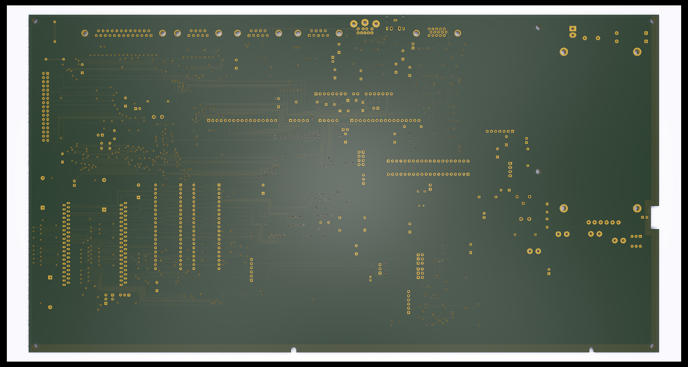

# Reproduction A3010 PCB #

This repository contains the schematics and PCB layout for a reproduction
of the Acorn A3010 computer PCB - specifically the 194,003 issue 1.

Other variations of the board exist and may be included as separate designs
at a future date.

Where possible the board matches the location of components and routing of
traces.

## Progress ##

The schematics and PCB design are both complete. An initial fabrication run has
been completed and in the process of being tested. The first board is populated
and while it appears to be working over the post port, there is no apparent video
output

### Changes from first test build ###

The AC inputs to the Mean Well psu were reversed. This should not technically
Be a problem for the psi so can be considered cosmetic.

Footprint pad sizes have been enlarged for the LQFP and J-leg components to aid
With hand assembly.

### Known issues ###

The specified fuse rating for the AC input is inadequate for the Mean Well psu.
The initial power-up produces a spike in current that blows the fuse immediately,
it may prove more appropriate to remove the fuse and add protection to the outputs 

## Factory Fixes ##

The original boards include a number of fixes, these have been incorporated
into the design where possible.

## Variations From Standard ##

In a few places the board is non-standard to allow the use of modern, available
components, most notably the power supply area of the board. Instead of the 
original circuits the board is designed to accept a Mean Well unit that is 
both lighter and more efficient.
