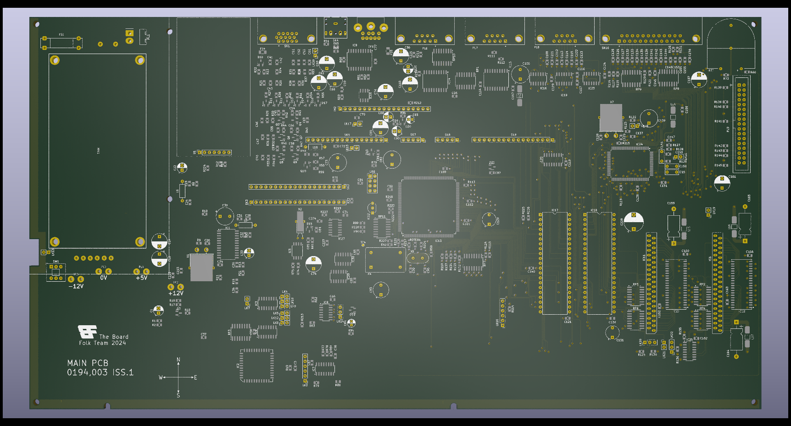

# Reproduction A3010 PCB #

This repository contains the schematics and PCB layout for a reproduction
of the Acorn A3010 computer PCB.

Where possible the board matches the location of components and routing of
traces.

## Progress ##

Ports, mounting points, CPU, RAM and ROM are accurately placed on the PCB.
Components that are flagged locked are positioned on measurements taken from
an original board.

Minor components such as resistors and capacitors are placed approximately
as "best fit".

Work on routing is focussed on the right hand side of the board that suffers
the worst when a battery leak occurs. Routing flow is faithful to the original
board but may not be accurately positioned.

## Factory Fixes ##

The original boards include a number of fixes. These will only appear in the
schematics once the board is otherwise complete. Provided there is space in
the layout the fixes will be incorporated into the design.
